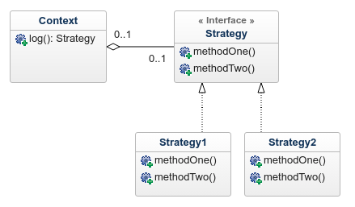

### Strategy Pattern:
- Assume we need to log some information. There are multiple ways we could do this LogToFile, LogToDatabase, LogToXWebService.

- The Strategy pattern allows us to polymorphically use any of the different strategies at runtime depending on the use case without creating complicated if statements and thereby making our system easily extensible

### Summary
The Strategy patterns defines a family of algorithms, encapsulates each one and then makes them interchangeable. And ultimately by leveraging polymorphism we are able to build loosely coupled applications where we are able to swap in and out various components at runtime
