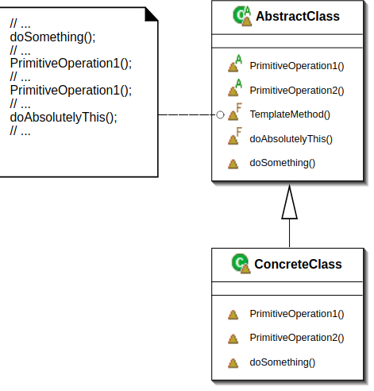

### Template Method Design Pattern

- In this case we have a general workflow/algorithm to do something, but some parts or steps of the algorithms might be different.

- Assume we want to implement OAuth authentication having different service provider. The steps for authentication might be the same for OAuth protocol, but we might have different implementations, key names, or URLs across different providers.

- Template Method fits in the above named scenario very well since we can provide a general workflow with invariant parts but leave placeholders for the different providers we need to implement.

Summary:
The template method is used in frameworks, where each implements the invariant parts of a domain's architecture, leaving "placeholders" for customization options.
