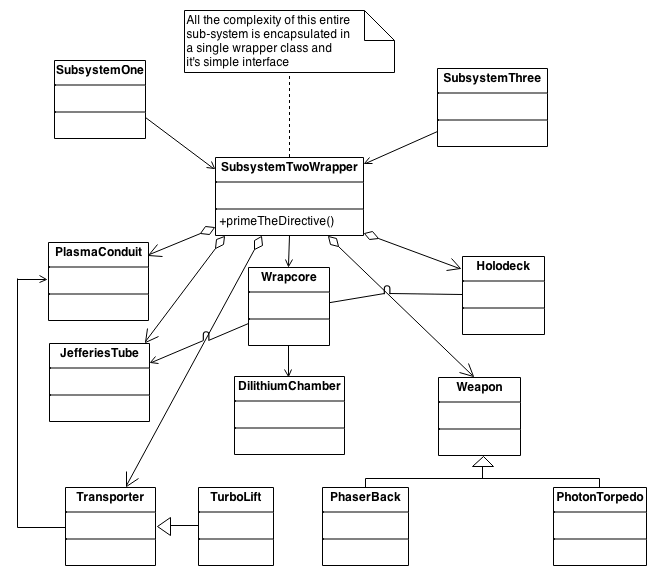

### Facade Pattern

#### Description
The Facade defines a unified, higher level interface to a subsystem that makes it easier to use. Lets assume we have three subsystems. Subsystem1, Subsystem2, and Subsystem3. The subsystems made up of complex functions that work together to perform a task. All subsystems need to communicate to perform the task.

For each subsystem we can create Facade that abstracts away the complex logic of each subsystem and provide a higher level interface which is easier to use.  

Below is an example of plugin a Facade on Subsystem2. Image adopted from https://sourcemaking.com/design_patterns/facade 

