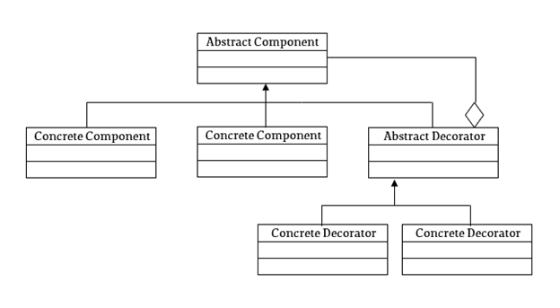
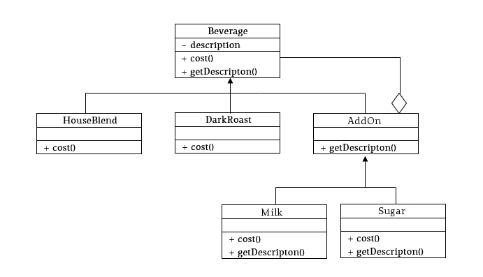

### Decorator Pattern

#### Description
Addresses the 'O' in SOLID principles. A class should be open to extensions but closed to modifications. Allows us to create objects at runtime. 

How it works: 
1. Have one interface (contract of what you are implementing eg <BeverageInterface>) all classes in this pattern will have contract of pizza. 
2. Have a base implementation/most basic implementation of <BeverageInterface> eg houseBlend
3. Have one abstract class which will be our decorator <BeverageDecorator> This abstract class will store an instance of type <BeverageInterface>
4. Now we can create classes that will implement <BeverageDecorator>

each number below reflects the description above
1. interface: <BeverageInterface> with methods getCost(), getDescription()
2. concrete: houseBlend<BeverageInterface> getCost() => 10, getDescription() => 'thin dough base'
3. abstract: beverageDecorator<BeverageInterface> getCost(), getDescription()
4. View the diagrams below

