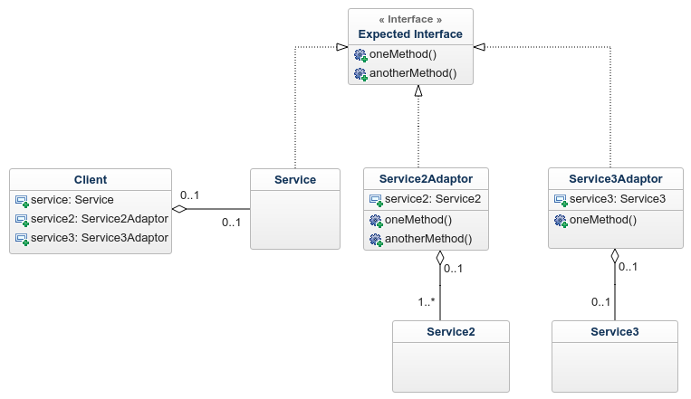

Scenario One:
- Assume we have a Client class consuming a LocalFileSystem API/Class which implements a LocalFileSystemInterface. Later we want to extend the functionality of the Client by using different kinds of filesystems, that is, RemoteFileSystem, AWSFileSystem, GoogleCloudFileSystem etc.

- Each of the additional classes each implement their own types of interface

- In this case the Adaptor Design Pattern would fit very well since we already have an Interface that the Client is already familiar with, and all we need is an Adaptor that will translate from the familiar interface(LocalFileSystem) to the different kinds of Interfaces as mentioned above.

- for example, if the Client is already used to a particular interface, we can continue using the same interface that the client understands to interface with other providers using various adaptors

Summary
The Adapter Pattern is an often-used pattern in object-oriented programming languages. Similar to adapters in the physical world, you implement a class that bridges the gap between an expected interface and an existing class. That enables you to reuse an existing class that doesn’t implement a required interface and to use the functionality of multiple classes, that would otherwise be incompatible.
